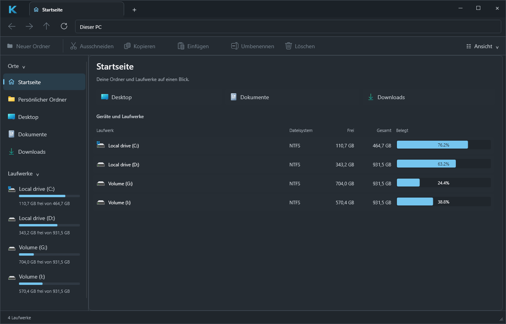
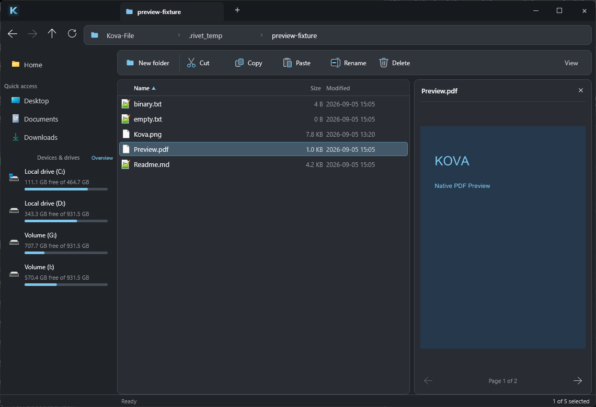

# Kova


Kova is an open-source desktop file manager for Windows 10/11, built with Rust,
Slint and native Windows APIs. Browse with tabs, compare drive capacity, preview
files and use your installed Windows Shell extensions in a compact dark interface.

> **Status:** Pre-1.0, under active development. The current release build has
> been exercised on Windows 11. See [runtime verification and preview limits](docs/VIEW_AND_PREVIEW.md)
> and [folder integration scope](docs/INTERACTION_INTEGRATION.md).



*Home is the start page. Double-click a drive to browse it, then use Back to
return to the overview.*

## File previews

Select a file and press **Space**, or enable **View > Preview pane**, to inspect
images, text and PDF pages beside the file list. Preview work runs off the UI thread.



*Screenshots show the real Windows release application. The PDF is a test fixture.*

## Features

**Navigation & tabs**

- Integrated title-bar tabs with close buttons and independent per-tab state
  (history, selection, sorting).
- Back / Forward / Parent / Refresh, clickable path breadcrumbs and `Ctrl+L`
  address editing, canonical path handling with visible errors.
- Compact command bar for New Folder, Cut, Copy, Paste, Rename and Delete;
  labeled actions collapse to icons in smaller windows.
- Optional default folder/drive opening in Kova, with backup and restore in the
  logo menu. See [setup and scope](docs/INTERACTION_INTEGRATION.md).
- Mouse back/forward (XBUTTON1/XBUTTON2) handled through the normal
  Slint input pipeline — no hooks, no window subclassing.
- Stale-result protection: per-tab generation/request IDs discard
  outdated directory snapshots.

**Sidebar & drives**

- Home opens the storage overview on startup and in new tabs, with independent
  Back/Forward history. Explicit folder launches still open their target directly.
- Places shortcuts (Desktop, Documents, Downloads) via
  `SHGetKnownFolderPath`, with real shell icons.
- Drive discovery at startup (`GetLogicalDriveStringsW` / `GetDriveTypeW`)
  with aligned Storage entries, usage bars and "X GB free of Y GB" details (danger color above 90 %
  usage).
- Storage overview with file system, free/total capacity and animated
  usage percentages; double-click a drive to open it.

**File list**

- Virtualized details view (name / type / size / modified) with header
  sorting and indicators, single / multi (`Ctrl`) / range (`Shift`)
  selection, hover and pressed states, clean empty and loading states.
- Mouse selection rectangle with Ctrl/Shift addition, Escape cancellation and
  automatic scrolling at the list edges.
- Shell icons resolved asynchronously by a dedicated worker thread with
  caching and generic fallbacks.
- View menu for hidden/system files, file extensions, row density and alternating
  row colors. Visibility changes preserve selection by path and use cached entries.
- Optional bounded background folder-size calculations on local fixed disks,
  with incomplete totals explicitly marked.
- Optional image, text and paginated PDF preview pane, decoded off the UI thread.
  See [view options and preview limits](docs/VIEW_AND_PREVIEW.md).

**Native Windows integration**

- Real Explorer shell context menu (`IContextMenu` with
  `IContextMenu2`/`IContextMenu3` message forwarding) for files and
  folders, including installed shell extensions (7-Zip, Git, "Open with",
  Properties). Multi-selection behaves like Explorer.
- Background context menu with New Folder, Paste, current folder in a new tab,
  sort column/direction, Refresh, Select All and Clear Selection.
- Copy / Cut / Paste / Delete through `IFileOperation` on a dedicated COM
  thread: Recycle-Bin deletes, native progress and conflict dialogs, the
  UI thread is never blocked.
- Explorer-compatible file clipboard (`CF_HDROP` + Preferred DropEffect) —
  works in both directions with Explorer.

**Keyboard**

- `F5` refresh, `F2` rename, `Del` delete, `Ctrl+C`/`Ctrl+X`/`Ctrl+V`
  clipboard, `Ctrl+A` select all, `Enter` open, `Alt+←/→/↑`
  back/forward/parent, `Ctrl+L` address bar.
- `Ctrl+H` toggles hidden files; `Space` toggles the preview pane from the file list.

## Architecture

| Crate | Role |
| --- | --- |
| `crates/kova-core` | Platform-independent domain logic — no `unsafe`, no Win32, no UI |
| `crates/kova-ops` | Filesystem operation execution (Tokio worker, test sandboxes) |
| `crates/kova-platform-windows` | Win32/Shell/COM integration (icons, menus, clipboard, ops) |
| `apps/kova-desktop` | Slint desktop application (UI, controllers, bridges) |

Directory enumeration, drive discovery, icon loading and shell
operations run on worker threads and results are pumped back to the UI
thread through an event queue. See
[`docs/ARCHITECTURE.md`](docs/ARCHITECTURE.md) for details.

## Building

Requirements:

- Windows 10/11 x64
- Rust stable with the MSVC toolchain (pinned in `rust-toolchain.toml`)
- Visual Studio 2022 Build Tools with the C++ workload

Slint's Skia renderer is enabled for Windows rendering. The first build may
download Skia's prebuilt libraries. MSVC builds reserve an 8 MiB main-thread
stack for Slint's generated UI, including debug builds.

Clone the repository, then build and launch the release application.
`scripts/cargo-msvc.ps1` locates Visual Studio and imports the MSVC environment:

```powershell
git clone https://github.com/cubiix3/Kova-File-Manager.git
cd Kova-File-Manager
.\scripts\cargo-msvc.ps1 -CargoArgs @('build', '--workspace', '--release')
.\target\release\kova-desktop.exe
```

Launching without arguments opens Home. To open a folder directly:

```powershell
.\target\release\kova-desktop.exe --open 'C:\Windows'
```

The logo menu offers optional per-user default folder/drive registration and
restoration. This does not intercept Win+E, file pickers, virtual Shell locations
or programs that explicitly invoke Explorer. Read the
[setup and restoration guide](docs/INTERACTION_INTEGRATION.md) before enabling it.

Quality gates (enforced by CI):

```powershell
.\scripts\cargo-msvc.ps1 -CargoArgs @('fmt', '--all', '--', '--check')
.\scripts\cargo-msvc.ps1 -CargoArgs @('check', '--workspace', '--all-targets')
.\scripts\cargo-msvc.ps1 -CargoArgs @('test', '--workspace')
.\scripts\cargo-msvc.ps1 -CargoArgs @('clippy', '--workspace', '--all-targets', '--all-features', '--', '-D', 'warnings')
```

## Roadmap

The current build includes tabbed navigation, native Shell menus and file
operations, mouse rectangle selection, a storage Home page, view preferences,
file previews and optional background folder-size calculation.

Not started yet: global search, drag & drop, undo, resizable
columns and cloud/network-specific handling. See
[`docs/PRODUCT.md`](docs/PRODUCT.md).

## Documentation

- [`docs/VIEW_AND_PREVIEW.md`](docs/VIEW_AND_PREVIEW.md) — Home, view options,
  previews, folder-size limits and latest runtime verification
- [`docs/INTERACTION_INTEGRATION.md`](docs/INTERACTION_INTEGRATION.md) — mouse
  selection and reversible default folder registration
- [`docs/VISUAL_POLISH.md`](docs/VISUAL_POLISH.md) — desktop chrome, branding and
  native menu verification
- [`docs/PRODUCT_AUDIT.md`](docs/PRODUCT_AUDIT.md) — product audit and findings
- [`docs/ARCHITECTURE.md`](docs/ARCHITECTURE.md) — workspace layout, crate
  responsibilities, concurrency model
- [`docs/PRODUCT.md`](docs/PRODUCT.md) — product goals and scope
- [`docs/SECURITY_AND_DATA_SAFETY.md`](docs/SECURITY_AND_DATA_SAFETY.md) —
  data-safety principles for file operations
- [`docs/PERFORMANCE_BASELINE.md`](docs/PERFORMANCE_BASELINE.md) —
  enumeration performance baseline
- [`docs/M0_REPORT.md`](docs/M0_REPORT.md) …
  [`docs/M2_REPORT.md`](docs/M2_REPORT.md) — milestone reports with
  runtime-verification evidence

## License

Licensed under either of [Apache-2.0](LICENSE-APACHE) or [MIT](LICENSE-MIT)
at your option.

Unless you explicitly state otherwise, any contribution intentionally
submitted for inclusion in Kova shall be dual licensed as above, without any
additional terms or conditions.

## Acknowledgments

- [files-community/Files](https://github.com/files-community/Files) (MIT) —
  studied as a UX/interaction reference (pointer states, tab switching,
  selection model, error surfacing). Kova is an independent implementation;
  selected MIT-licensed icon geometry is adapted with attribution in
  [`ui/third-party`](apps/kova-desktop/ui/third-party/README.md). See
  [`docs/research/FILES_REFERENCE.md`](docs/research/FILES_REFERENCE.md).
