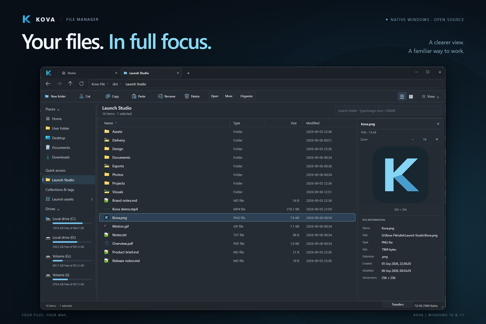
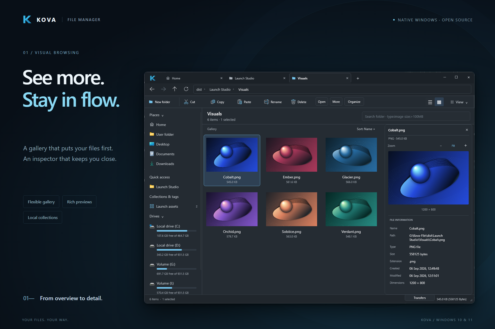
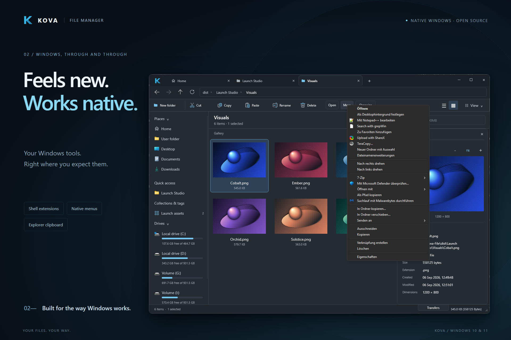
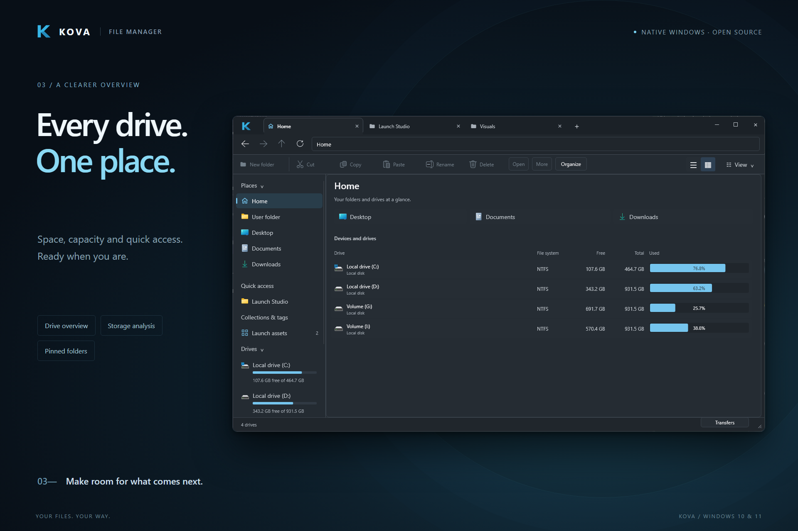
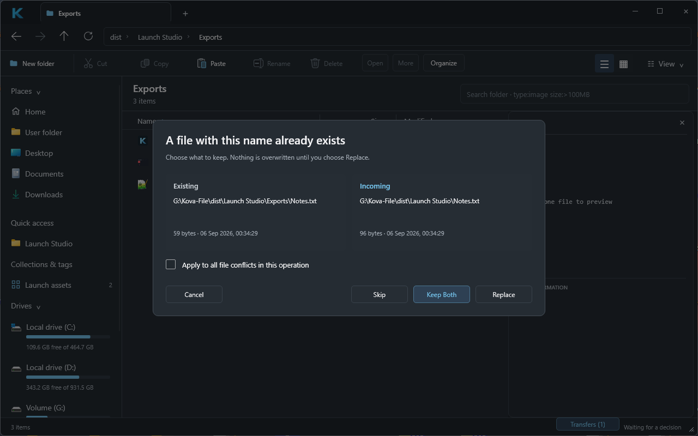

<p align="center">
  
</p>

<h1 align="center">Kova</h1>
<p align="center">A native Windows file manager. Your files, with a clearer view.</p>

<p align="center">
  <a href="https://github.com/cubiix3/Kova-File-Manager/releases">Download for Windows</a> ·
  <a href="#a-closer-look">Screenshots</a> ·
  <a href="docs/VIEW_AND_PREVIEW.md">User guide</a> ·
  <a href="https://github.com/cubiix3/Kova-File-Manager/issues">Report an issue</a>
</p>

[](docs/images/current-details.png)

Kova combines tabbed browsing, a thumbnail gallery, native Windows context menus
and an inspector in a compact desktop interface. Built with **Rust, Slint and Win32/Shell APIs** for
Windows 10/11 x64. No Electron or WebView.

> **Early preview:** Kova is under active development. The current source uses
> English interface labels and the next-generation features below. The v0.1.0
> download predates this update; build the current source to try these features.
> See the
> [verification notes](docs/APPROVED_DESIGN.md) for tested behavior and limits.

## Download & install

1. Open [GitHub Releases](https://github.com/cubiix3/Kova-File-Manager/releases).
2. Download **Kova-Setup-0.1.0-x64.exe** from the release's **Assets** section.
3. Run Setup, then launch Kova from the Start menu. A desktop shortcut is optional.

The installer includes the required Visual C++ runtime files and installs for
your Windows account. Rust and Visual Studio are not required. To remove Kova,
use **Windows Settings → Apps → Installed apps → Kova → Uninstall**.

Prefer a ZIP? Download **Kova-0.1.0-x64.zip**, extract the entire archive and run
**Kova.exe**. Keep the included DLLs beside the executable. Package checksums
are available in **SHA256SUMS.txt**. The preview packages are not code-signed.

Folder-opening integration is optional and can be enabled or restored from the
Kova logo menu. See [what it covers](docs/INTERACTION_INTEGRATION.md); it does not
replace Win+E, Windows file pickers or every explicit Explorer invocation.

<a href="https://slint.dev"></a>

## What you can do

| Feature | Included |
| --- | --- |
| **Browse** | Tabs with independent history, breadcrumbs, automatic folder updates, familiar shortcuts and mouse Back/Forward |
| **Manage files** | Native copy, move and Recycle Bin deletion; transfer history, progress and cancellation; explicit Replace / Skip / Keep Both conflicts |
| **See more** | Details and three gallery sizes; image, text and PDF inspector; animated GIF, WebP and APNG; media metadata and Shell thumbnails |
| **Stay organized** | Local tags and collections, pinned folders with reordering; sortable columns and rectangular multi-selection |
| **Find files** | Instant current-folder filtering by name, extension, type, size and modification date |
| **Check storage** | Drive type, file system and capacity; cancellable background analysis with largest folders/files and proportional bars |
| **Adjust the view** | Hidden/system files, file extensions, row density, alternating rows and a resizable preview pane |
| **Use Windows tools** | Native Shell menus with installed extensions, associated applications and Explorer-compatible clipboard |

## A closer look

### See more. Stay in flow.

Switch between Details and Gallery without changing the folder or selection.
Choose small, medium or large tiles, then inspect a file alongside the gallery.

[](docs/images/current-gallery.png)

Select a file and press **Space**. Read text, inspect images or page through a PDF
alongside your files. GIF, animated WebP and APNG support Play/Pause.

### Feels new. Works native.

Use your installed Shell extensions, associated applications and familiar
Windows commands directly from Kova's native context menu.

[](docs/images/current-native.png)

### Every drive. One place.

Compare capacity and free space in Home, then open a drive or analyze a folder's
storage. Keep your regular destinations close with pinned folders.

[](docs/images/current-home.png)

These product images use real captures of the current release build with
demonstration files. Click an image for the original screenshot.
[About the images](docs/DEMO.md) · [Feature guide and limitations](docs/NEXTGEN.md).

### Stay in control of transfers

Review source and destination, progress and completed work in Transfers. File
collisions wait for your choice; folder merges retain native Windows handling.



## Familiar shortcuts

| Action | Shortcut |
| --- | --- |
| New tab / close tab | `Ctrl+T` / `Ctrl+W` |
| Edit address / refresh | `Ctrl+L` / `F5` |
| Back / forward / parent | `Alt+Left` / `Alt+Right` / `Alt+Up` |
| New folder / rename | `Ctrl+Shift+N` / `F2` |
| Copy / cut / paste | `Ctrl+C` / `Ctrl+X` / `Ctrl+V` |
| Select all / delete | `Ctrl+A` / `Delete` |
| Toggle preview | `Space` |
| Filter the current folder | `Ctrl+F` |

## Build from source

Use Windows x64, Rust stable with the MSVC target, and Visual Studio with the
**Desktop development with C++** workload. The first build downloads dependencies
and may download prebuilt Skia libraries.

```powershell
git clone https://github.com/cubiix3/Kova-File-Manager.git
cd Kova-File-Manager
.\scripts\cargo-msvc.ps1 build --locked --workspace --release
.\target\release\kova-desktop.exe
```

See [Contributing](CONTRIBUTING.md) for quality checks and
[Windows packaging](docs/WINDOWS_RELEASE.md) for building the installer.

## Project documentation

- [Gallery, search, transfers and local organization](docs/NEXTGEN.md)
- [User guide: views, previews and storage](docs/VIEW_AND_PREVIEW.md)
- [Windows integration and restoration](docs/INTERACTION_INTEGRATION.md)
- [Current design and runtime verification](docs/APPROVED_DESIGN.md)
- [Product scope and planned work](docs/PRODUCT.md)
- [Architecture](docs/ARCHITECTURE.md) · [Data safety](docs/SECURITY_AND_DATA_SAFETY.md)
- [Documentation index and historical reports](docs/README.md)

Global search, drag & drop, split panes, application-level undo and full session
restoration are still planned. Please check the documented limits before relying
on a particular preview format or integration path.

## License & acknowledgments

Kova's source is dual-licensed under [MIT](LICENSE-MIT) or
[Apache-2.0](LICENSE-APACHE). Dependencies retain their own licenses; distributed
packages include third-party notices.

Built with [Slint](https://slint.dev). [Files](https://github.com/files-community/Files)
was studied as a UX reference; adapted MIT-licensed icon geometry is credited in
[the icon notices](apps/kova-desktop/ui/third-party/README.md). Kova is an
independent implementation with its own branding.
