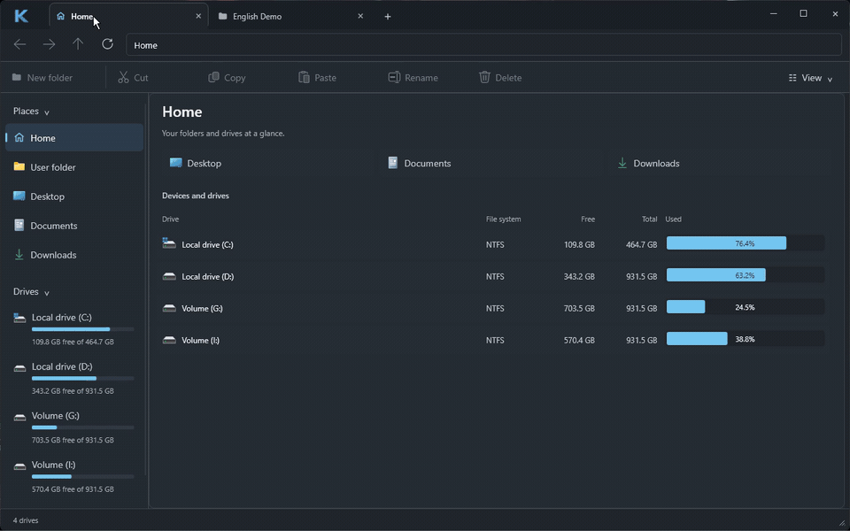
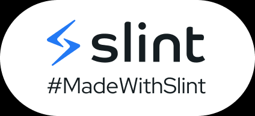
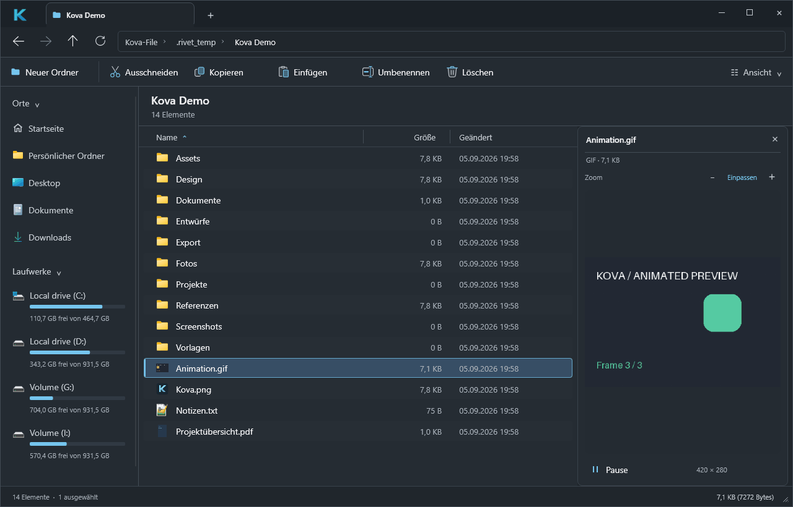

<p align="center">
  
</p>

<h1 align="center">Kova</h1>
<p align="center">A native Windows file manager. Your files, with a clearer view.</p>

<p align="center">
  <a href="https://github.com/cubiix3/Kova-File-Manager/releases">Download for Windows</a> ·
  <a href="#a-closer-look">Screenshots</a> ·
  <a href="docs/VIEW_AND_PREVIEW.md">User guide</a> ·
  <a href="https://github.com/cubiix3/Kova-File-Manager/issues">Report an issue</a>
</p>

[](docs/media/kova-demo.mp4?raw=true)

**Kova in 28 seconds** · [Download the MP4](docs/media/kova-demo.mp4?raw=true) · [Static screenshot](docs/images/details-view.png)

Recorded from the English development build on Windows 11. Native Shell menus
follow the Windows language. [Recording details](docs/DEMO.md).

Kova combines tabbed browsing, native Windows context menus and file previews in
a compact desktop interface. Built with **Rust, Slint and Win32/Shell APIs** for
Windows 10/11 x64. No Electron or WebView.

> **Early preview:** Kova is under active development. The current source uses
> English interface labels; the v0.1.0 download still contains the earlier mixed-language UI.
> See the
> [verification notes](docs/APPROVED_DESIGN.md) for tested behavior and limits.

## Download & install

1. Open [GitHub Releases](https://github.com/cubiix3/Kova-File-Manager/releases).
2. Download **Kova-Setup-0.1.0-x64.exe** from the release's **Assets** section.
3. Run Setup, then launch Kova from the Start menu. A desktop shortcut is optional.

The installer includes the required Visual C++ runtime files and installs for
your Windows account. Rust and Visual Studio are not required. To remove Kova,
use **Windows Settings → Apps → Installed apps → Kova → Uninstall**.

Prefer a ZIP? Download **Kova-0.1.0-x64.zip**, extract the entire archive and run
**Kova.exe**. Keep the included DLLs beside the executable. Package checksums
are available in **SHA256SUMS.txt**. The preview packages are not code-signed.

Folder-opening integration is optional and can be enabled or restored from the
Kova logo menu. See [what it covers](docs/INTERACTION_INTEGRATION.md); it does not
replace Win+E, Windows file pickers or every explicit Explorer invocation.

<a href="https://slint.dev"></a>

## What you can do

| Feature | Included |
| --- | --- |
| **Browse** | Tabs with independent history, breadcrumbs, familiar shortcuts and mouse Back/Forward |
| **Manage files** | Copy, cut, paste and Recycle Bin deletion through native Windows operations; inline New Folder and Rename |
| **See more** | Image, text and PDF previews; animated GIF, WebP and APNG playback; file thumbnails |
| **Stay organized** | Sortable, resizable columns; Ctrl/Shift selection and mouse selection rectangle |
| **Check storage** | Home with drive capacity, free space and usage bars; optional background folder-size calculation |
| **Adjust the view** | Hidden/system files, file extensions, row density, alternating rows and a resizable preview pane |
| **Use Windows tools** | Native Shell menus with installed extensions, associated applications and Explorer-compatible clipboard |

## A closer look

### Start with your drives

Home opens at startup. Compare capacity and free space, then double-click a drive
to browse it. Explicit folder launches open the requested folder directly.


### Preview without leaving the folder

Select a file and press **Space**. Read text, inspect images or page through a PDF
alongside your file list. Resize the pane and use Fit or zoom for a closer look.


<details>
<summary>Watch an animated preview</summary>



GIF, animated WebP and APNG support Play/Pause. Playback stops when the selection
changes or the pane closes.

</details>

These are real application captures using demonstration files, recorded on
Windows 11 on September 5, 2026.

## Familiar shortcuts

| Action | Shortcut |
| --- | --- |
| New tab / close tab | `Ctrl+T` / `Ctrl+W` |
| Edit address / refresh | `Ctrl+L` / `F5` |
| Back / forward / parent | `Alt+Left` / `Alt+Right` / `Alt+Up` |
| New folder / rename | `Ctrl+Shift+N` / `F2` |
| Copy / cut / paste | `Ctrl+C` / `Ctrl+X` / `Ctrl+V` |
| Select all / delete | `Ctrl+A` / `Delete` |
| Toggle preview | `Space` |

## Build from source

Use Windows x64, Rust stable with the MSVC target, and Visual Studio with the
**Desktop development with C++** workload. The first build downloads dependencies
and may download prebuilt Skia libraries.

```powershell
git clone https://github.com/cubiix3/Kova-File-Manager.git
cd Kova-File-Manager
.\scripts\cargo-msvc.ps1 build --locked --workspace --release
.\target\release\kova-desktop.exe
```

See [Contributing](CONTRIBUTING.md) for quality checks and
[Windows packaging](docs/WINDOWS_RELEASE.md) for building the installer.

## Project documentation

- [User guide: views, previews and storage](docs/VIEW_AND_PREVIEW.md)
- [Windows integration and restoration](docs/INTERACTION_INTEGRATION.md)
- [Current design and runtime verification](docs/APPROVED_DESIGN.md)
- [Product scope and planned work](docs/PRODUCT.md)
- [Architecture](docs/ARCHITECTURE.md) · [Data safety](docs/SECURITY_AND_DATA_SAFETY.md)
- [Documentation index and historical reports](docs/README.md)

Global search, drag & drop, split panes, application-level undo and full session
restoration are still planned. Please check the documented limits before relying
on a particular preview format or integration path.

## License & acknowledgments

Kova's source is dual-licensed under [MIT](LICENSE-MIT) or
[Apache-2.0](LICENSE-APACHE). Dependencies retain their own licenses; distributed
packages include third-party notices.

Built with [Slint](https://slint.dev). [Files](https://github.com/files-community/Files)
was studied as a UX reference; adapted MIT-licensed icon geometry is credited in
[the icon notices](apps/kova-desktop/ui/third-party/README.md). Kova is an
independent implementation with its own branding.
