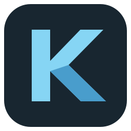

# Kova



Kova is a fast, native-first file manager for Windows 10/11 — built with Rust,
Slint, and the official Windows APIs (`windows-rs`). No webviews, no Electron,
no runtime emulation: a real Win32/Shell integration with a GPU-rendered
native UI.

> **Status:** Pre-1.0 — native desktop file manager with product-audit fixes and
> refined UI. See [verification and remaining limits](docs/PRODUCT_AUDIT.md).

## Features

**Navigation & tabs**

- Integrated title-bar tabs with close buttons and independent per-tab state
  (history, selection, sorting).
- Back / Forward / Parent / Refresh, clickable path breadcrumbs and `Ctrl+L`
  address editing, canonical path handling with visible errors.
- Compact command bar for New Folder, Cut, Copy, Paste, Rename and Delete;
  labeled actions collapse to icons in smaller windows.
- Mouse back/forward (XBUTTON1/XBUTTON2) handled through the normal
  Slint input pipeline — no hooks, no window subclassing.
- Stale-result protection: per-tab generation/request IDs discard
  outdated directory snapshots.

**Sidebar & drives**

- Quick Access (Home, Desktop, Documents, Downloads) via
  `SHGetKnownFolderPath`, with real shell icons.
- Drive discovery at startup (`GetLogicalDriveStringsW` / `GetDriveTypeW`)
  with usage bars and "X GB free of Y GB" details (danger color above 90 %
  usage).

**File list**

- Virtualized details view (name / type / size / modified) with header
  sorting and indicators, single / multi (`Ctrl`) / range (`Shift`)
  selection, hover and pressed states, clean empty and loading states.
- Shell icons resolved asynchronously by a dedicated worker thread with
  caching and generic fallbacks.

**Native Windows integration**

- Real Explorer shell context menu (`IContextMenu` with
  `IContextMenu2`/`IContextMenu3` message forwarding) for files and
  folders, including installed shell extensions (7-Zip, Git, "Open with",
  Properties). Multi-selection behaves like Explorer.
- A small Kova context menu on empty space (New Folder, Paste, Refresh).
- Copy / Cut / Paste / Delete through `IFileOperation` on a dedicated COM
  thread: Recycle-Bin deletes, native progress and conflict dialogs, the
  UI thread is never blocked.
- Explorer-compatible file clipboard (`CF_HDROP` + Preferred DropEffect) —
  works in both directions with Explorer.

**Keyboard**

- `F5` refresh, `F2` rename, `Del` delete, `Ctrl+C`/`Ctrl+X`/`Ctrl+V`
  clipboard, `Ctrl+A` select all, `Enter` open, `Alt+←/→/↑`
  back/forward/parent, `Ctrl+L` address bar.

## Architecture

| Crate | Role |
| --- | --- |
| `crates/kova-core` | Platform-independent domain logic — no `unsafe`, no Win32, no UI |
| `crates/kova-ops` | Filesystem operation execution (Tokio worker, test sandboxes) |
| `crates/kova-platform-windows` | Win32/Shell/COM integration (icons, menus, clipboard, ops) |
| `apps/kova-desktop` | Slint desktop application (UI, controllers, bridges) |

Directory enumeration, drive discovery, icon loading and shell
operations run on worker threads and results are pumped back to the UI
thread through an event queue. See
[`docs/ARCHITECTURE.md`](docs/ARCHITECTURE.md) for details.

## Building

Requirements:

- Windows 10/11 x64
- Rust stable with the MSVC toolchain (pinned in `rust-toolchain.toml`)
- Visual Studio 2022 Build Tools with the C++ workload

Slint's Skia renderer is enabled for Windows rendering. The first build may
download Skia's prebuilt libraries. MSVC builds reserve an 8 MiB main-thread
stack for Slint's generated UI, including debug builds.

`scripts/cargo-msvc.ps1` locates Visual Studio, imports the MSVC
environment and runs the requested cargo command:

```powershell
.\scripts\cargo-msvc.ps1 cargo build --workspace --release
.\scripts\cargo-msvc.ps1 cargo run --bin kova-desktop
```

Quality gates (enforced by CI):

```powershell
.\scripts\cargo-msvc.ps1 -CargoArgs @('fmt', '--all', '--', '--check')
.\scripts\cargo-msvc.ps1 -CargoArgs @('check', '--workspace', '--all-targets')
.\scripts\cargo-msvc.ps1 -CargoArgs @('test', '--workspace')
.\scripts\cargo-msvc.ps1 -CargoArgs @('clippy', '--workspace', '--all-targets', '--all-features', '--', '-D', 'warnings')
```

## Roadmap

Implemented: M0 (runtime foundation), M1 (shell icons, context menus, mouse
navigation), M2 (native shell menus, copy/cut/paste/delete), M3 (visual
polish: sidebar, tabs, toolbar, rows, drives, empty states).

Not started yet: global search, preview pane, drag & drop, undo, resizable
columns, "This PC" overview, cloud/network-specific handling. See
[`docs/PRODUCT.md`](docs/PRODUCT.md).

## Documentation

- [`docs/PRODUCT_AUDIT.md`](docs/PRODUCT_AUDIT.md) — current audit and verification
- [`docs/ARCHITECTURE.md`](docs/ARCHITECTURE.md) — workspace layout, crate
  responsibilities, concurrency model
- [`docs/PRODUCT.md`](docs/PRODUCT.md) — product goals and scope
- [`docs/SECURITY_AND_DATA_SAFETY.md`](docs/SECURITY_AND_DATA_SAFETY.md) —
  data-safety principles for file operations
- [`docs/PERFORMANCE_BASELINE.md`](docs/PERFORMANCE_BASELINE.md) —
  enumeration performance baseline
- [`docs/M0_REPORT.md`](docs/M0_REPORT.md) …
  [`docs/M2_REPORT.md`](docs/M2_REPORT.md) — milestone reports with
  runtime-verification evidence

## License

Licensed under either of [Apache-2.0](LICENSE-APACHE) or [MIT](LICENSE-MIT)
at your option.

Unless you explicitly state otherwise, any contribution intentionally
submitted for inclusion in Kova shall be dual licensed as above, without any
additional terms or conditions.

## Acknowledgments

- [files-community/Files](https://github.com/files-community/Files) (MIT) —
  studied as a UX/interaction reference (pointer states, tab switching,
  selection model, error surfacing). Kova is an independent implementation;
  selected MIT-licensed icon geometry is adapted with attribution in
  [`ui/third-party`](apps/kova-desktop/ui/third-party/README.md). See
  [`docs/research/FILES_REFERENCE.md`](docs/research/FILES_REFERENCE.md).
