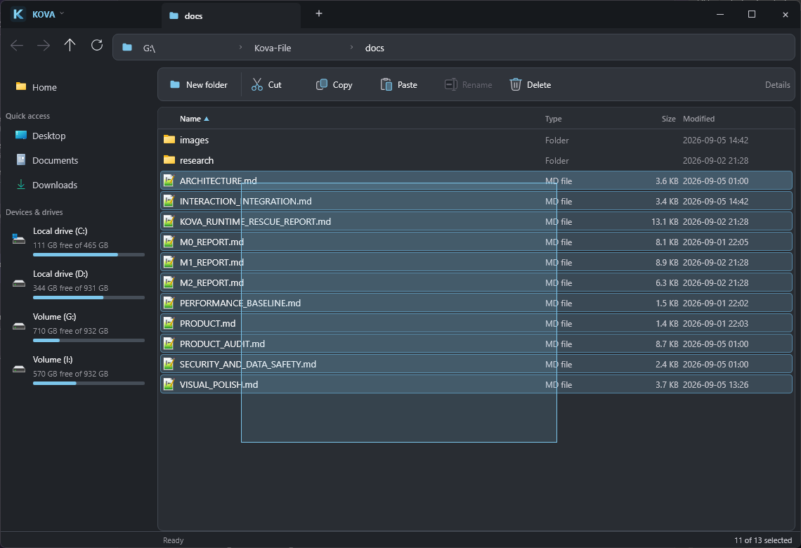

# Mouse selection and default folder opening

## Mouse selection

Drag with the left button from blank space or a file row to draw a selection
rectangle. Dragging back shrinks the selection. Ctrl/Shift preserves the selection
from mouse-down and adds the intersected rows. Escape restores that baseline.
The list scrolls automatically near its top/bottom edge. A stable input surface
keeps the gesture alive as rows are virtualized; only changed selection flags
are written to the existing model. Navigation/loading cancels the gesture.

## Open Windows folders in Kova

Click the **Kova logo at top left**, then **Use Kova for folders and drives**.
Kova installs its executable in `%LOCALAPPDATA%\Kova\Kova.exe`, backs up the
current user's folder/drive defaults, and registers the `Kova.OpenFolder` verb
under `HKCU\Software\Classes\Directory\shell` and `Drive\shell`. No administrator
rights are required. File associations and the desktop shell are not changed.

Explicit `open`, `explore` and `opennewwindow` verbs for Directory and Drive are
also registered. Their previous per-user command and `DelegateExecute` values
are saved separately in `folder-commands.json`. Empty delegate values mask the
machine's Explorer COM handler. This fixes explicit Open calls that bypassed
the earlier default-only registration (including a reproduced drive open).
Older installations are upgraded without replacing their original backup.

To undo, choose **Restore previous folder app** from the same menu. This restores
the saved default/command values and removes Kova's own verb. If another app has changed
the default since activation, that newer default is preserved. Keep the backup
in `%LOCALAPPDATA%\Kova\folder-associations.json` until restoring.
Keep `folder-commands.json` alongside it. Restore preserves a later replacement
command and its delegate; it removes newly-created command keys only when empty.

Equivalent repository commands:

```powershell
.\scripts\default-file-manager.ps1 -Mode Enable
.\scripts\default-file-manager.ps1 -Mode Status
.\scripts\default-file-manager.ps1 -Mode Restore
```

Kova also accepts `kova-desktop.exe --open "C:\Some folder"` (or a bare path).
Shell registration handles drive roots and quoted Unicode/space-containing paths.
After updating the build, close installed Kova windows and enable again from the
new build to update the installed executable.

Scope: normal default Shell folder/drive opens. Explicit `explorer.exe` launches,
Win+E, virtual Shell folders, file-picker dialogs, and applications that force an
Explorer-specific API remain Windows-controlled. This does not claim to replace
all Explorer functionality. Each external folder launch opens a Kova window.

## Verification

Actual release mouse/keyboard input and Windows Shell execution:

- Blank-space drag selected all 12 fixture rows; shrinking reduced it to 3.
- Escape restored the original selection; Ctrl-drag retained an existing item.
- A drag starting on a row selected the expected four adjacent rows.
- Edge scrolling selected 52/150 rows, including rows beyond the viewport.
- Single, Ctrl and Shift clicks, double-click folder navigation, native file
  context menu and blank-space context menu retained their behavior.
- Enabling through the Kova menu installed and registered Kova. Windows default
  folder opening launched the installed app at a path containing spaces and an
  umlaut; opening `G:\` also reached the correct drive root.
- Restore through the menu removed Kova's verb/default and consumed the backup.
  Kova was then enabled again as requested.
- Explicit `Open` on `G:\` reproduced the previous Explorer fallback. After the
  correction it launched the installed Kova executable. A real restore compared
  all six command/delegate backups against the restored registry, including
  earlier File Pilot registrations. Repeated Enable preserved the original backup.
- All three explicit verbs (`open`, `explore`, `opennewwindow`) launched the
  installed app at both a drive root and a folder containing spaces and an umlaut;
  each resulting address was read from the real Slint window.
- fmt / workspace check / tests / clippy with warnings denied / release passed;
  47 tests passed and 3 were intentionally ignored.

Not verified: UNC launch on an actual reachable network share, Windows 10 runtime,
and association changes made concurrently by another application.



References: [Microsoft Shell verbs](https://learn.microsoft.com/en-us/windows/win32/shell/fa-verbs)
and [Shell extension registration classes](https://learn.microsoft.com/en-us/windows/win32/shell/reg-shell-exts).
