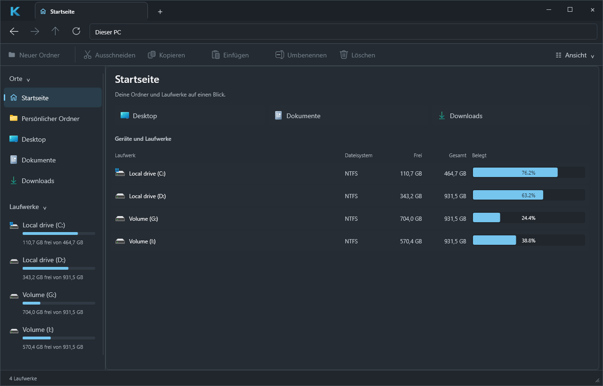
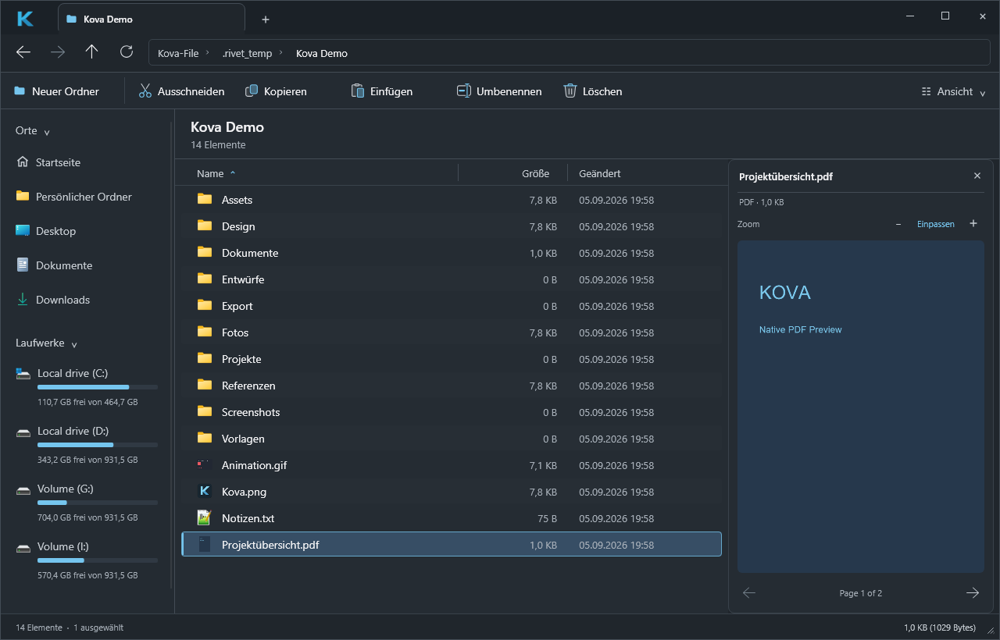

# View options and previews

The **View** menu at the right of the command bar contains preview visibility,
storage overview, folder-size calculation, hidden files, system files, file extensions, compact rows, alternating row
colors and the loading-logo animation. The top-left menu now uses only the
Kova logo. It gently pulses during directory loading; animation can be disabled.

Hidden and system flags use Windows file attributes. Files carrying both flags
require both options. Extension hiding changes the displayed name only; opening,
renaming and other operations keep the complete path. Filtering reuses cached
entries in all tabs, remaps selection by path and excludes invisible items from
Select All and subsequent operations. Icons are queued when entries become visible.
Preferences are stored on normal app exit in `%LOCALAPPDATA%\Kova\view-options.txt`.

## Preview pane

### File-list thumbnails

Small previews appear beside file names without opening the preview pane.
PNG, JPEG, GIF, BMP, TIFF and ICO use Windows image decoding when supported;
WebP has a bundled Rust decoder and needs no Windows codec installation.
PDFs use their first page. Other file types, including formats supplied by installed
codecs/extensions, are requested through `IShellItemImageFactory` with
`SIIGBF_THUMBNAILONLY`. Missing or failed providers leave the normal type icon.
Support for a video or document format depends on the installed Windows provider;
this is not a claim that every file has a visual preview.

Automatic thumbnails run on a separate worker, on local fixed disks only, skipping
observed reparse/offline/recall attributes. Only visible rows plus a small margin
are requested (maximum 128). The queue and result channel are bounded; the cache
holds at most 256 outcomes, including failures, with images capped at 64 pixels.
Rows update in place. Leaving a directory or refreshing changes the generation,
so outdated results cannot replace the current view. A provider already decoding
is allowed to finish; navigation does not wait for it.

### Inspector

Select one file and choose **View > Preview pane**, or press **Space** in the file
list. The pane supports common raster images, plain text/source files, and PDF
pages with previous/next controls. Unsupported, unreadable and binary files show
a message. It is read-only; scripts and document content are not executed.

GIF, animated WebP and APNG (`.png` or `.apng`) play automatically in a loop in
the inspector. **Pause / Play** preserves the current frame. Switching files,
navigating, refreshing, showing Home or closing the pane cancels the old stream.
Single-frame files have no playback button. List thumbnails stay still.

Animation uses the bundled image decoders on the preview worker. Frames are
composited by the decoder and scaled to at most 640 pixels, with two output frames
queued rather than the entire clip cached. GIF/APNG decoder allocations are
limited to 64 MiB; all animation canvases are limited to 4 million pixels before
frame allocation. Oversized or failed animation decoding falls back to a still
preview where possible and explains the limitation. Authored frame delays are
retained with a 20 ms minimum, scheduled on a 16 ms UI timer; slow decoding can
reduce playback speed. The inspector loops independently of the file's repeat
count. Video/audio playback is not included.

One worker performs filesystem reads and Windows Runtime decoding. Its pending
queue is bounded to one request; obsolete results are rejected by generation,
selected path and page. Images are rendered at up to 1024 pixels on the long edge,
respecting EXIF orientation. Inputs above 128 MiB or images above 80 million pixels
are not previewed. WebP additionally limits the decoded pixel buffer to 64 MiB before
allocation and uses the same 64/1024-pixel thumbnail/inspector output sizes.
Text reads at most 64 KiB and supports UTF-8 and BOM-marked
UTF-16; invalid UTF-8 uses replacement characters. PDFs use Windows.Data.Pdf,
without a WebView, and display one page at a time. Password-protected PDFs show
the decoder error; password entry is not included.

In narrow windows, lower-priority details columns disappear to leave readable
file names beside the preview. This is a preview pane, not a second file pane.

## Storage and folder sizes

**Home** is the start page when Kova launches without a folder argument and when
creating a new tab. Click **Home** or **View > Drives and storage** to return to it.
The storage overview shows Windows volume labels, file system, free/total bytes
and usage percentages. Its usage bars animate into place, unless animations are
disabled. Double-click opens a drive; Back/Forward traverse Home and folders in
each tab's own history. Home is a virtual location with no filesystem target;
file creation and paste are disabled there. Explicit folder launches bypass Home.
Drive capacity is read on startup and refreshed with F5 on Home, off the UI thread.
Arrow keys select a drive and Enter opens it.

The sidebar groups navigation into **Places** and **Storage**. Section labels,
icons and item names share consistent left anchors; Home uses a house glyph.
Selected links use a slim accent marker and a muted surface. Drive capacity bars
sit below the name, with free/total space beneath them. The full-width Home table
provides the larger capacity comparison.

**View > Calculate folder sizes** enables a separate worker for local fixed disks.
The Size column fills with logical file-byte totals, including nested entries.
Scans skip observed reparse points, offline files and recall-on-data-access items;
they stop after two seconds or 50,000 entries per folder. `≥` marks a lower bound,
never a falsely complete size. These totals are not allocated size on disk, and
hard-linked file paths can count separately. Network/removable roots display
Local Only. Refresh starts a new calculation; navigation and disabling the option
invalidate pending results. Both request and result queues are bounded.

When Size sorting is requested, known folder totals are used and selection is
remapped by path. Background totals do not continuously reorder rows under the
mouse: click the Size header again to re-sort with later results.

## Verification

Real release mouse/keyboard verification on Windows 11:

- PNG image and UTF-8 text with umlaut/Japanese characters rendered.
- File-list miniatures rendered for PNG, JPEG, GIF, BMP, TIFF, ICO, transparent
  logo PNG and PDF. A DIB fixture exercised the Windows Shell thumbnail provider.
  WebP initially lacked a Windows decoder; the bundled decoder then rendered it
  both in the list and inspector. A corrupt PNG retained its normal file icon.
- Scrolling a 150-image fixture displayed the correct per-file miniatures beyond
  the original viewport. Replacing an image at the same path and pressing F5
  replaced its thumbnail; returning between folders retained the correct images.
- Two-page PDF rendered; clicking Next changed the displayed page and page count.
- Binary text fixture produced the expected message.
- GIF, animated WebP and APNG fixtures each showed three different frames in
  captured release-app playback. GIF Pause held the same preview pixels across
  eight captures; Play resumed the three-frame sequence. Switching from a paused
  animation to text displayed the text correctly; a broken GIF showed an error,
  and a still PNG showed its image without playback controls. Closing/reopening
  the pane, Home/Back, F5 and 780 × 600 resize were exercised with the animation.
  [Release playback recording](images/preview-playback.gif).
- Actual Hidden/System attribute fixtures appeared when their View switches were
  enabled (5 to 6 to 7 visible items); hiding extensions changed labels only.
- Preview remained usable at 1140 × 780 and 780 × 600 without overlapping controls.
- Background Select All selected all seven visible fixtures; Clear Selection
  cleared them. Open This Folder created a second tab at the same path.
- Sort submenu changed to descending and visibly reordered the rows.
- Native file context menu retained installed extensions including 7-Zip.
- Clean window close wrote the expected view preferences.
- Reopening restored preview visibility. Empty text files showed an explicit hint.
- Storage overview rendered all four local NTFS drives at normal and compact sizes;
  double-clicking the G: row navigated to its actual root.
- Starting the final release without arguments opened Home. Drive double-click,
  Alt+Left/Right, Home Ctrl+T/Ctrl+W, arrow selection/Enter and F5 were exercised.
  Home remained usable at 1140 × 780 and 780 × 600. Deferred focus avoids a Slint
  accessibility-tree reentrancy panic during Home/folder transitions.
- The installed executable's hash matched the final release. Windows Shell Open
  launched it directly at the fixture folder; a separate no-argument launch
  opened Home. Folder registration status reported complete.
- The refined sidebar was checked at both window sizes. Clicking Desktop and
  the C: sidebar entry opened their real targets, and Back returned to Home.
  Scrolling at 780 × 600 exposed the last drive's complete capacity line.
- Folder fixtures displayed 0 B (empty), 3.0 KB (nested files), 2.0 MB (larger file)
  and ≥ 0 B for a directory containing a junction back to the fixture root.
  Size sorting placed the 3 KiB folder before the 2 MiB folder.

Automated tests cover visibility/selection remapping, retained operation paths
when hiding extensions, text encodings and binary detection, alongside the
existing navigation/selection/operations suite.
The WebP regression test encodes a transparent image and checks its thumbnail's
dimensions, pixel-buffer length and preserved RGBA values without a Windows codec.
Animation tests cover frame timing, looping, pause timing, cancellation with a
full output queue, zero-delay throttling and oversized canvas rejection.
The five local quality gates passed with 60 tests passing and 3 intentionally ignored.

The inspector now has a draggable divider, file type/size metadata and Fit or
25–400% zoom. Zoom refers to decoded preview pixels, not original-file resolution.
See [desktop refinement and naming verification](PRODUCT_REFINEMENT.md).
The later [approved desktop design](APPROVED_DESIGN.md) adds German primary
labels, draggable table columns and explicit native window-resize input regions.

NOT VERIFIED: Windows 10 runtime, reachable UNC shares, password-protected PDFs,
huge/malformed image and PDF fixtures, EXIF-rotated photos, optional installed
image codecs, video/Office thumbnail providers and screen-reader behavior.
These are not reported as runtime passes.

Microsoft references: [PDF rendering](https://learn.microsoft.com/en-us/uwp/api/windows.data.pdf.pdfdocument.loadfromstreamasync),
[bitmap transforms](https://learn.microsoft.com/en-us/uwp/api/windows.graphics.imaging.bitmaptransform),
and [Shell thumbnail ownership and threading](https://learn.microsoft.com/en-us/windows/win32/api/shobjidl_core/nf-shobjidl_core-ishellitemimagefactory-getimage).
