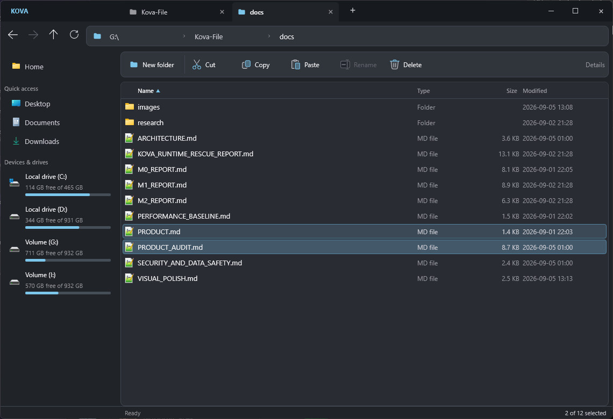

# Integrated desktop polish

The caption and tabs now share one compact header, with working minimize,
maximize/restore and close controls. Empty caption space supports mouse dragging
and double-click maximize; Slint/winit handles the frameless resize border.
No Win32 subclass or raw handle hook was introduced. Windows 11 DWM provides rounded window corners. Native popup menus opt into UXTheme dark mode; the optional exports are version-gated (Windows 10 1903+) and their library reference lives with the event loop. Every new unsafe block documents its safety conditions.

The Files-inspired layout separates navigation from file commands: clickable
path segments (last three ancestors), Ctrl+L full-path editing with Escape cancel,
a responsive New Folder/Cut/Copy/Paste/Rename/Delete bar, an inset details surface,
neutral charcoal tokens, denser sidebar and aligned drive usage bars. Existing
file operations, virtualized models and native Shell context menus are retained.
Nine MIT-licensed Files icon geometries are adapted with
[attribution and full license](../apps/kova-desktop/ui/third-party/README.md).

## Verification (2026-09-05)

Real release application, actual mouse/keyboard input:

- Startup and caption close/exit; minimize, maximize, restore, double-click
  maximize, caption drag and corner resize all passed.
- 1140x780 and 780x550 rendering inspected. Tabs create/switch/close, path
  breadcrumbs, address Enter/Escape, Back/Forward/Parent, single/Ctrl selection,
  sorting, unavailable-path error and dialog focus/cancel checked.
- Command-bar New Folder and Rename confirmed by filesystem changes; Copy
  confirmed by CF_HDROP; Paste/cut-move confirmed by destination contents and
  source removal; Delete confirmed in the Windows Recycle Bin. Clipboard restored.
- Native multi-selection Shell menu and installed 7-Zip submenu opened successfully
  after the custom caption change; native dark menu and dark 7-Zip submenu were visually verified after theme opt-in. Rounded outer corners were inspected in the final release screenshots.
- All five gates passed: fmt, check (all targets), tests (45 passed, 3 intentionally
  ignored), clippy (all targets/features, warnings denied), release build.

NOT VERIFIED in this follow-up: Windows 10 runtime, mixed-DPI monitors, Windows
Snap flyout on maximize hover, Explorer clipboard interoperability and Properties
retest. Earlier product-audit results are historical; see [audit](PRODUCT_AUDIT.md).
Thumbnail/grid views, split panes and cloud features are not part of this change.

[Compact window](images/visual-polish-compact.png) · [Dialog](images/visual-polish-dialog.png)

[Dark native Shell menu](images/visual-polish-shell-menu.png)

Implementation references: [Microsoft DWM corner guidance](https://learn.microsoft.com/en-us/windows/apps/desktop/modernize/ui/apply-rounded-corners) and [Microsoft PowerToys native dark-mode integration](https://github.com/microsoft/PowerToys/blob/main/src/modules/ZoomIt/ZoomIt/Utility.cpp). Menu colors remain Windows-rendered; third-party owner-drawn items may choose their own appearance. UXTheme ordinals are private APIs and fall back when unavailable.
